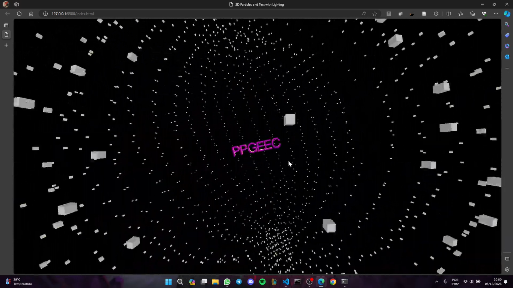

# Projeto - AP 02 - Uso da API Three JS e conceitos de Computação Gráfica para uma cena 3D de sistema de partículas para o PPGEEC

## Simulação do sistema solar

## Apresentação do projeto
[Link para apresentação](https://youtu.be/993Ajt0Rfhg)

## Equipe 
<li> Alanna Maria Machado Alves Paiva - 421942 
<li>Ananda Karen Barros Nobre - 421784 
<li>Antonia Thamires Maia Mesquita - 427342 
<li>Daniel Araujo Paiva - 432312 
<li>Vitor Cesar Oliveira Gomes Arruda - 428229 
